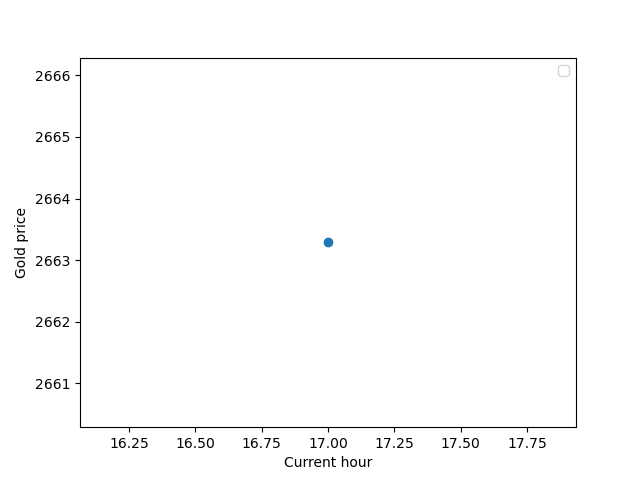

# Gold_price_predictor

## Prediction Problem
In this project we aim to predict the gold price for cuurent hour. When we say the gold price we mean the close price for the current hour. The prediction will be based on different features such as the inflation rate, volume and all of features  will be realated to the previous hour.
## Pipelines

In this project we made four pippelines in order to conduct and implment the project. 
### Backfill 
In the backfill file we request the data from the Binanc API. Firstly we connect to the API. Then we request data for gold hourly prices for the last year. This data contains features such as timestamp, open high, low close, and volume. Then we save these data in CSV files. However, for the gold we use the PAX asset which completely represents the gold price, and for the currency, we use USDT, which also has the USD as a base. Another feature that we also collected is the EURUSDT. This feature represents if the USDT changes prices in comparison to the euro. We thought also of having a feature BTCUSDT, but we found there is no strong correlation between the bitcoin and the PAX prices. Same for bitcoin and USDT. The reason is both USDT and PAX have a physical asset as a base and therefore  both are stable in price-changing terms. Finally, in this file, we save the features on the Hopswerk so we can extract these features later. 

### Features 
In this file, we use something similar to what we have before, where the difference is to get the hourly live data. This data is useful in terms the prediction which occurs hourly. To make the prediction we take the last closed-hour gold price and the inflation rate (which is the change of price for EURUSDT for that last closed hour and hour before) and save it to a file.

### Training

In our training we retrieve the historic data from hopworks and we select appropriate features to train our model. To train our model we used XGBoost Regressor and we splited the data into training and test sets. We also stored the model into hopwrks to reuse it for the predcitios in the inference pipline 

### Inference 

In this pipline what we do is just predict the gold price for the current hour. We start by retreive the data and the model from hopworks and then predcit the gold price. We repesent the predction as plot and save it in the docs 

## Results

The evaluation of our model was based on the prediction of the test data. The test error (MSE) was The 43.1

Here we can see one plot that present the predction of gold price in 17:00

## Reflection and Discussion

In this project we tried to automate the adding of new features into Hopworks and the inference and prediction of the new added data. However we was not able to run the github action. The reason is that we use Binaca API in the features.ipynb and when the Github actions run this we get an error that indicates "restricted location". Therefore we run these files locally several times and one sees the result in the docs. Every plot represents a prediction for a new hour , while csv file contain the newly added data into hopworks.

The model seems to perform well and the reason is that data of the previous hour and current hour is related and when we pass all features of the previous hour then it will predict the gold price. However , it is interesting to test other models and see if we get a noticeable difference in the performance.

In the feature , one could add new data to train the model, because we used only data for the last 365 days. More data will give more generalization power to the model to predict the gold price.

## References 

Lab 1

## How TO RUN

Downlaod the packages in the requiremnt.txt, for instance in anconda envirment, and run the files
